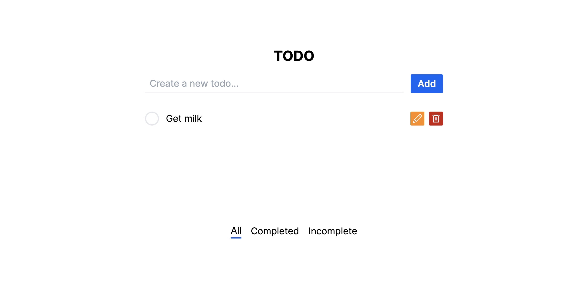

# Todolist frontend

I want to make a simple full-stack CRUD app so that I can focus on TDD, understanding TypeScript and process.

See [https://github.com/sarahc-dev/todolist-collection](https://github.com/sarahc-dev/todolist-collection) for a description of the app, my original planning and wireframes.

For this version of the frontend, I am using:

- Next.js (React)
- TypeScript
- TailwindCSS
- Cypress - E2E and component testing

## Setup

```bash
# Set up folder to test full app
mkdir todolist
cd todolist

git clone https://github.com/sarahc-dev/todolist-frontend-nextjs.git frontend
cd frontend
npm install
```

Test frontend components by running either:

```bash
# Select Component Testing in browser window
npm run cypress:open

# or
npx cypress run --component
```

To setup the full-stack app:

```bash
# Install and run the Express backend
cd ..
git clone https://github.com/sarahc-dev/todolist-collection.git api
cd api
npm install

# Run the test server in a new terminal
npm run start:test
```

To run e2e tests:

```bash
# In a terminal run frontend server
cd frontend
npm run dev

# In new terminal run tests
npm run cypress:open
# or
npx cypress run --e2e
```

## App preview



## API

In order for this frontend to function correctly, the backend API must respond to the following requests:

### Get all todos

GET [http://localhost:8080/api/todos](http://localhost:8080/api/todos)  
Response:

```plain
[{
    _id: "1",
    title: "todo",
    completed: false
}, {
    _id: "2",
    title: "another todo",
    completed: false
}]
```

### Add todo

POST [http://localhost:8080/api/todos](http://localhost:8080/api/todos)  
Request Body: { title: "Added todo" }  
Response:

```plain
{
    _id: "1",
    title: "Added todo",
    completed: false
}
```

### Edit todo

PATCH [http://localhost:8080/api/todos/{id}](http://localhost:8080/api/todos/{id})  
Request Body: { key: value } to update

### Delete todo

DELETE [http://localhost:8080/api/todos/{id}](http://localhost:8080/api/todos/{id})

## Process

I began using create-next-app to set up the project using Next.js, TypeScript and TailwindCSS. I set up Cypress and started with my first e2e test. I then created a test for the functionality of adding a todo and with this failing test, I dipped out to create component tests and test drive the TodoForm and TodoList components before putting these together and seeing the e2e test pass. I repeated this for the other functionality of editing and deleting todos.

When I had a fully functioning app, I then created a useTodoApi hook and created the fetch requests to connect my frontend to my backend API. I refactored the code and the tests to work with the API.

Once the functionality was working, I added a small amount of CSS to complete the app.

## Learnings

It was interesting how much more I considered the structure of each component using strictly TDD and how my components are much smaller than I might have created in the past to make testing easier. It was also a challenge focusing on tdd and also on the bigger picture of how all the components needed to work together and how to manage state across the app so each component is rerendering when it should.

I debated how far to take the testing. I did try to use Jest and Testing Library to unit test the hook but ran into trouble using Cypress and Jest together with TypeScript. I also came across an argument not to do this - there is very little business logic to test once I had mocked fetch. Ultimately I decided my e2e tests would be sufficient.
